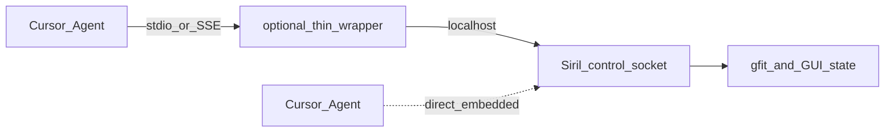

# Siril MCP: Option B then built-in Option C

> Canonical plan for this repo. Cursor also keeps a copy under `.cursor/plans/`; prefer editing **this** file when iterating.

## Overview

Build an Option B MCP stack (external Cursor MCP + in-Siril Python bridge) that works with the official Siril.app, prove it with real-photo test queries, then evolve successful tools into a first-class Option C control channel with GUI-only APIs.

## Todos

- [x] **scaffold-siril-mcp** — Create this package: MCP stdio server, socket client, bridge.py, README + Cursor mcp.json
- [x] **implement-v1-tools** — Implement ping/state/list_commands/run_command/get_preview/set_selection/get_stats/undo via sirilpy
- [x] **install-bridge-helper** — Add script to install bridge into Siril user scripts; document pyscript -async startup
- [x] **smoke-test-real-data** — Unit tests for protocol/PNG/catalog pass; live Siril queries A–C are manual (see README)
- [ ] **phase2-friendly** — Scripts-menu launcher polish, richer metadata/star tools, harden safety/workspace root
- [ ] **phase3-option-c** — After B proves out: persistent GUI control socket in Siril + APIs for scripting gaps

## Defaults

- **Host for Option B:** this repo (`~/code/siril-mcp`). Sibling `~/code/siril-1.4.4` is only for later Option C patches.
- **Transport:** Cursor **stdio MCP** ↔ thin server ↔ **localhost Unix socket** ↔ bridge running inside Siril.
- **Target runtime:** `/Applications/Siril.app` via `pyscript -async`; no custom Siril build for Phase 1.

## Architecture (Phase 1 / Option B)

**Two processes you start:**

1. In Siril: run `pyscript -async /path/to/siril-mcp/bridge/bridge.py` (or Scripts menu entry once installed).
2. Cursor MCP config points at `python -m siril_mcp` (stdio server).

If the bridge is down, MCP tools return a clear “start bridge in Siril” error—not silent filesystem fallbacks.

### Package layout (this repo)

- `bridge/bridge.py` — long-lived script; connects with `SirilInterface`, listens on e.g. `~/Library/Application Support/siril-mcp/bridge.sock`
- `src/siril_mcp/` — MCP server (stdio), tool schemas, socket client, image helpers
- `catalog/commands.json` — curated scriptable command list (generated/trimmed from Siril docs / `../siril-1.4.4/src/core/command_list.h` later)
- `scripts/install_bridge_to_siril_scripts.sh` — copy/symlink bridge into Siril user scripts dir
- `README.md` — Cursor `mcp.json` snippet + start procedure

### MCP tools (v1 — thin wrappers over existing APIs)

| Tool | Backing | Purpose |
|------|---------|---------|
| `siril_ping` | bridge heartbeat | Health / version |
| `siril_get_state` | `is_image_loaded`, shape, filename, selection, basic keywords | Orient the agent |
| `siril_list_commands` | static catalog + optional `help` | What scripts can do |
| `siril_run_command` | `SirilInterface.cmd(*parts)` | Single command with args |
| `siril_run_script` | write temp `.ssf`/`.py` then `pyscript`/`cmd` | Multi-step workflows |
| `siril_get_preview` | `get_image_pixeldata(preview=True, shape=roi?)` → PNG | Vision loop |
| `siril_set_selection` | `set_siril_selection` | Focus agent attention |
| `siril_get_stats` | `get_image_stats` / `stat` | Quantitative checks |
| `siril_undo` | `undo()` | Safe iteration |

**Preview policy:** always return an 8-bit autostretched PNG, max edge 1024 (configurable), optional ROI. Prefer in-memory/base64 image content for the model; also write a debug path under a temp dir when useful.

**Safety:** workspace root preference (default: last Siril cwd / user-configured data dir); refuse absolute paths outside it unless explicitly allowed; wrap processing with Siril’s image lock patterns where `sirilpy` requires it; always surface `status`/exceptions to the agent.

### Explicit non-goals for v1

- Attaching without a started bridge
- GUI-only features (curves UI, remixer, compositing, `visu`/`inspector`)
- Replacing official scripts repo sync
- Headless `siril-cli -p` as primary path (keep as Phase 1.5 fallback profile only if GUI bridge proves flaky)

## Phase 1 implementation steps

1. Scaffold this repo with MCP SDK + socket protocol (`ping`, `call`, `get_preview`).
2. Implement `bridge.py` against official-app `sirilpy` (see `../siril-1.4.4/python_module/sirilpy/connection.py`: `cmd`, `get_image_pixeldata`, selection, undo).
3. Wire Cursor MCP entry + README start checklist.
4. Smoke-test on a single FITS/XISF you pick: load → state → preview → stretch → preview → undo.
5. Expand catalog + a few “recipe” prompts (below) using your real library.

## Phase 2 — Make Option B “friendly”

Once tools feel useful day-to-day:

- One-click **Scripts → Start MCP Bridge** (install helper copies into Siril scripts folder; optional `requires` header for version).
- Status file / tray log line: socket path, PID, last error.
- Richer tools: `findstar` summary, `jsonmetadata`, sequence frame preview, SPCC/platesolve wrappers with structured results.
- Optional headless twin: same MCP tool names over `siril-cli -p` for batch nights.

## Phase 3 — Option C (built into Siril)

Promote the proven tool surface into Siril itself (work in `../siril-1.4.4` or a GitLab fork):

**C1 — Persistent control channel while GUI is up**

- New local socket (or reuse/generalize patterns from `siril_pythonmodule.c` + `pipe.c`) that does **not** require headless `-p`.
- Auto-start optional “MCP/agent endpoint” from Preferences; no manual `pyscript`.
- Same JSON tool contract as Phase 1 so the external MCP server stays a thin adapter (or Siril speaks MCP natively later).

**C2 — Expose gaps that scripting cannot reach** (only after B validates demand)

Priority candidates (today non-scriptable / GUI-heavy):

- Display / STF / visu state matching what the user sees
- Inspector-style diagnostics
- Curves / remixer / compositing hooks (or documented command equivalents)
- Reliable `load_seq` / sequence context for Python-style metadata without GUI-only paths
- True canvas screenshot (overlays/zoom) vs `gfit` preview

Each C2 item becomes an explicit API behind the control socket, then a matching MCP tool—avoid boiling the ocean.

## Canonical test queries (use your real photos)

Run these in order once the bridge is up. Prefer one **broadband OSC** target and one **narrowband or mono stack** if you have both.

### A. Connectivity and inspection

1. *“Ping Siril and tell me if an image is loaded, its size, filename, and current selection.”*
2. *“List the Siril commands related to stretching and histogram.”*
3. *“Show me a preview of the current image (max 1024px). Describe background, stretch, and any obvious gradients or clipping.”*

### B. Load and characterize a light

4. *“In my photos folder `<PATH>`, find a recent stacked FITS/XISF of `<TARGET>`, load it in Siril, and show a preview.”*
5. *“Summarize FITS keywords that matter (exposure, filter, date, telescope/camera) and basic per-channel stats.”*
6. *“Detect stars and report approximate FWHM / star count; does this look soft, trailed, or undersampled?”*

### C. Closed-loop visual edit

7. *“The background looks uneven. Sample/inspect, suggest a background extraction approach, apply it, show before/after previews, and undo if it looks worse.”*
8. *“Apply an autostretch suitable for preview, then a gentler permanent stretch for processing; show previews after each; undo back to linear if I ask.”*
9. *“Select the core of the nebula/galaxy (roughly center 25%), preview that crop only, and comment on color and detail.”*

### D. Calibration / plate solve (if data supports it)

10. *“Plate-solve the current image and tell me the field center, pixel scale, and rotation.”*
11. *“Run spectrophotometric color calibration if possible; show preview before and after; undo on failure.”*

### E. Sequence / project awareness (stretch goal for late Phase 1)

12. *“What’s in this working directory—lights/darks/flats structure? Propose a preprocessing script, but don’t run stacking until I confirm.”*
13. *“Dry-run: outline the `register` + `stack` commands you would use for sequence `<NAME>`, including rejection and normalization choices.”*

### F. Negative tests (prove integration, not filesystem cosplay)

14. *“Without loading anything via tools, can you describe the current Siril image?”* — must fail or use live state, not invent from disk.
15. *“Crop using selection, save a JPEG preview to temp, reload original via undo—confirm the GUI image is restored.”*

**Pass criteria:** agent decisions change after seeing previews; undo works; errors when bridge down are explicit; no reliance on listing random folders as a substitute for `get_state`/`get_preview`.

## Success → proceed to Option C when

- You regularly use A–C queries without fighting the bridge lifecycle.
- At least one workflow is blocked by a **known scripting gap** (document it).
- Preview loop latency is acceptable on your typical megapixel stacks.

Then implement C1 (always-on socket) first; add C2 APIs only for gaps you actually hit.

## What we will not do in the first build

- Patch Siril C for MCP until Phase 3.
- Build a full preprocessing autopilot.
- Depend on OpenCV/GTK inside the MCP server process—keep heavy lifting in Siril/`sirilpy`.
